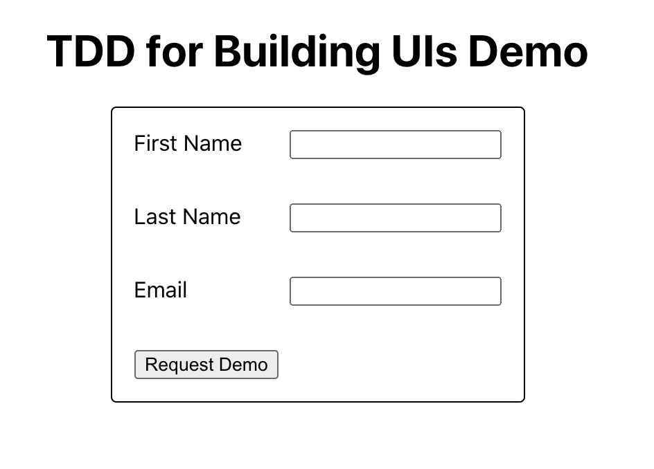
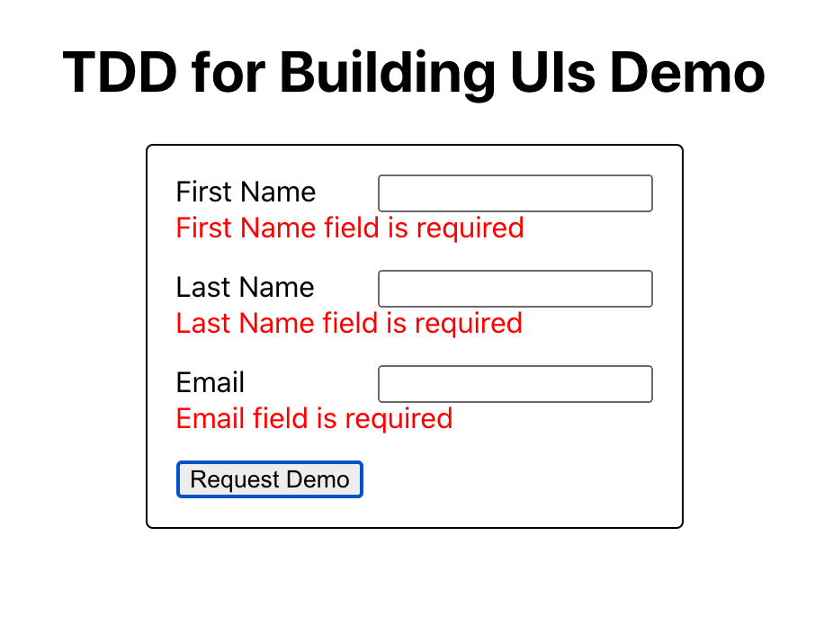
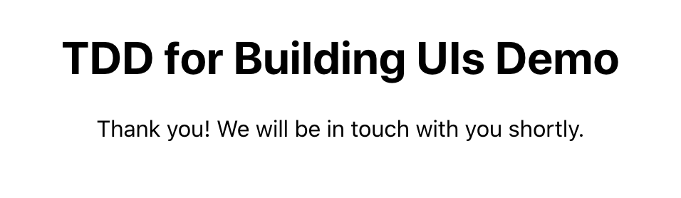
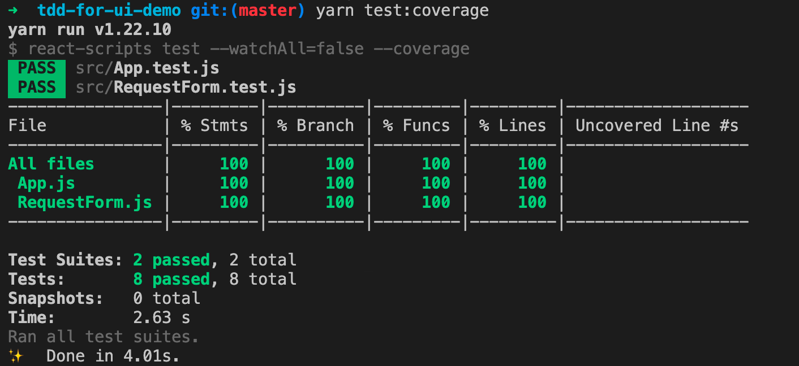

# TDD for Building UIs Demo

This project is used in a presentation to show how we can use test-driven development to build user interfaces. It's not as hard as you may think!

## Running Locally

1. `yarn install`
2. `yarn start`

## NPM Scripts

- `build`: Builds the production app
- `eject`: Ejects from `react-scripts`
- `format`: Formats the code using Prettier
- `format:watch`: Formats the code using Prettier in watch mode
- `start`: Starts the app for running locally in development mode
- `test`: Runs the unit tests with Jest and React Testing Library in watch mode
- `test:coverage`: Runs the unit tests and generates a coverage report

## Product Requirements

Your task is to create a form that allows interested users to request a demo of our product. See the mocks for how this should look.

The basic requirements are:
1. The form displays three inputs for first name, last name, and email address
2. The form displays a submit button
3. If any of the form inputs are left blank or filled out incorrectly, an error message should display
4. When the form is successfully submitted, the form should disappear and be replaced with a confirmation message

## Design Mocks

Initial UI: 

Error messages appear on form submission if fields are left blank:

Confirmation text is shown after the form is successfully submitted:

## Presentation Steps

1. Create a `RequestForm.test.js` file
2. Write a test that renders the form (fails)
3. Create a `RequestForm.js` file and have the component render an empty `form` element (passes)
4. Write a test that looks for a first name input (fails)
5. Render a first name input and label (passes)
6. Write a test that looks for a last name input (fails)
7. Render a last name input and label (passes)
8. Refactor your code to render the form inputs in a column (note that the tests continue to pass during our refactor!)
9. Write a test that looks for the email address input (fails)
10. Render an email input and label (passes)
11. Refactor your code to line up the form inputs in nice columns (note that the tests continue to pass during our refactor!)
12. Write a test that looks for a submit button (fails)
13. Render a submit button (passes)
14. Refactor your code to center the form on the page and place it in a bordered box (note that the tests continue to pass during our refactor!)
15. Write a test that verifies error messages are shown if the user attempts to submit a blank form
16. Change the `RequestForm` to use controlled components and state. Write `onChange` and `onSubmit` methods to handle updating the form values and showing error messages when any of the form fields are empty and the form is submitted (passes)
17. Refactor the code to show the error messages in red and keep the form a consistent height (note that the tests continue to pass during our refactor!)
18. Write a test that verifies the form can be successfully submitted (fails)
19. Update the code to render the confirmation text when the form is submitted (passes)

## Final Code Coverage Result

